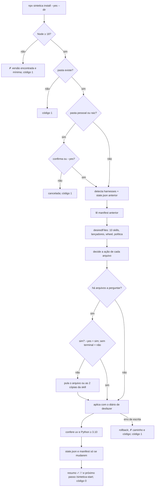
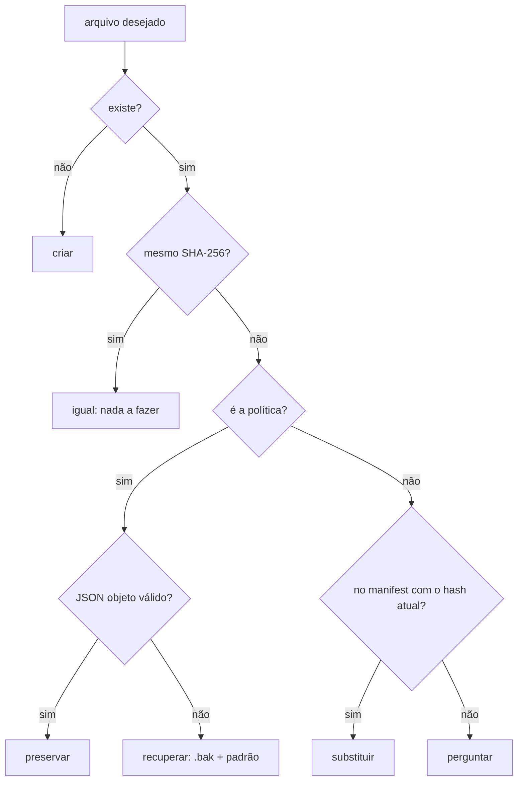

# Fluxograma: módulo `installer`

> 🟢 Extraído de `installer/src/install.js`, `plan.js`, `files.js` e `prompt.js`.

## `npx sintetica install`

```mermaid
flowchart TD
    A[npx sintetica install --yes --dir] --> B{Node ≥ 18?}
    B -- não --> E1[✗ versão encontrada e mínima; código 1]
    B -- sim --> C{pasta existe?}
    C -- não --> E1b[código 1]
    C -- sim --> D{pasta pessoal ou raiz?}
    D -- sim --> Q{confirma ou --yes?}
    Q -- não --> E1c[cancelada; código 1]
    D -- não --> H
    Q -- sim --> H[detecta harnesses + state.json anterior]
    H --> M[lê manifest anterior]
    M --> P[desiredFiles: 10 skills, lançadores, wheel, política]
    P --> AC[decide a ação de cada arquivo]
    AC --> ASK{há arquivos a perguntar?}
    ASK -- sim --> R{sim? --yes = sim; sem terminal = não}
    R -- não --> SK[pula o arquivo ou as 2 cópias da skill]
    R -- sim --> AP
    ASK -- não --> AP[aplica com o diário de desfazer]
    SK --> AP
    AP --> RT[confere uv e Python ≥ 3.10]
    RT --> ST[state.json e manifest só se mudarem]
    AP -- erro de escrita --> RB[rollback; ✗ caminho e código; código 1]
    ST --> OUT[resumo ✓ / ! e próximo passo /sintetica-start; código 0]
```

## Ação por arquivo

```mermaid
flowchart TD
    A[arquivo desejado] --> B{existe?}
    B -- não --> C[criar]
    B -- sim --> D{mesmo SHA-256?}
    D -- sim --> E[igual: nada a fazer]
    D -- não --> F{é a política?}
    F -- sim --> G{JSON objeto válido?}
    G -- sim --> H[preservar]
    G -- não --> I[recuperar: .bak + padrão]
    F -- não --> J{no manifest com o hash atual?}
    J -- sim --> K[substituir]
    J -- não --> L[perguntar]
```
