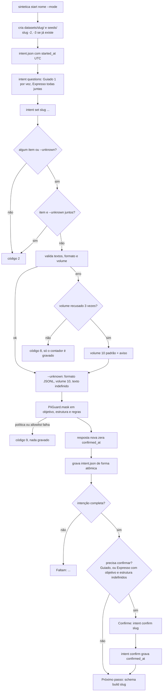

# Fluxograma: módulo `intent`

> 🟢 Extraído de `src/sintetica/intent/service.py`, `answers.py` e `summary.py`.

## Entrevista

```mermaid
flowchart TD
    A[sintetica start nome --mode] --> B[cria datasets/slug/ e seeds/<br/>slug -2, -3 se já existe]
    B --> C[intent.json com started_at UTC]
    C --> D[intent questions: Guiado 1 por vez, Expresso todas juntas]
    D --> E[intent set slug ...]
    E --> F{algum item ou --unknown?}
    F -- não --> E2[código 2]
    F -- sim --> G{item e --unknown juntos?}
    G -- sim --> E2
    G -- não --> H[valida textos, formato e volume]
    H -- erro --> I{volume recusado 3 vezes?}
    I -- sim --> J[volume 10 padrão + aviso]
    I -- não --> E8[código 8, só o contador é gravado]
    H -- ok --> K[--unknown: formato JSONL, volume 10, texto indefinido]
    J --> K
    K --> L[PiiGuard.mask em objetivo, estrutura e regras]
    L -- política ou allowlist falha --> E9[código 9, nada gravado]
    L --> M[resposta nova zera confirmed_at]
    M --> N[grava intent.json de forma atômica]
    N --> O{intenção completa?}
    O -- não --> P[Faltam: ...]
    O -- sim --> Q{precisa confirmar?<br/>Guiado, ou Expresso com objetivo e estrutura indefinidos}
    Q -- sim --> R[Confirme: intent confirm slug]
    Q -- não --> S[Próximo passo: schema build slug]
    R --> T[intent confirm grava confirmed_at]
    T --> S
```
