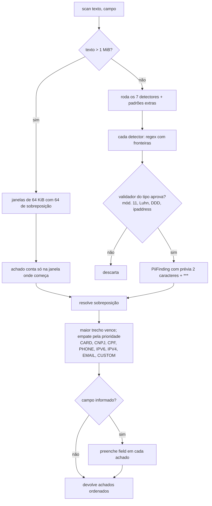
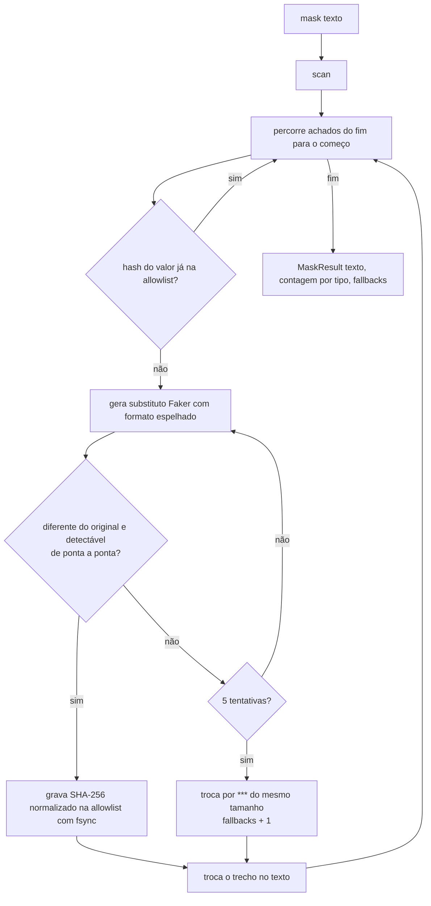
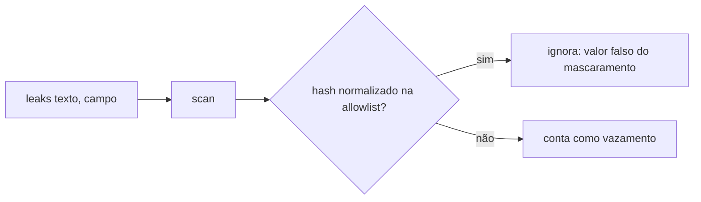

# Fluxograma: módulo `pii`

> 🟢 Extraído de `src/sintetica/pii/guard.py`.

## `PiiGuard.scan`

```mermaid
flowchart TD
    A[scan texto, campo] --> B{texto > 1 MiB?}
    B -- não --> C[roda os 7 detectores + padrões extras]
    B -- sim --> D[janelas de 64 KiB com 64 de sobreposição]
    D --> E[achado conta só na janela onde começa]
    C --> F[cada detector: regex com fronteiras]
    F --> G{validador do tipo aprova?<br/>mód. 11, Luhn, DDD, ipaddress}
    G -- não --> H[descarta]
    G -- sim --> I[PiiFinding com prévia 2 caracteres + ***]
    E --> J[resolve sobreposição]
    I --> J
    J --> K[maior trecho vence; empate pela prioridade<br/>CARD, CNPJ, CPF, PHONE, IPV6, IPV4, EMAIL, CUSTOM]
    K --> L{campo informado?}
    L -- sim --> M[preenche field em cada achado]
    L -- não --> N[devolve achados ordenados]
    M --> N
```

## `PiiGuard.mask`

```mermaid
flowchart TD
    A[mask texto] --> B[scan]
    B --> C[percorre achados do fim para o começo]
    C --> D{hash do valor já na allowlist?}
    D -- sim --> C
    D -- não --> E[gera substituto Faker com formato espelhado]
    E --> F{diferente do original e detectável<br/>de ponta a ponta?}
    F -- não --> G{5 tentativas?}
    G -- não --> E
    G -- sim --> H[troca por *** do mesmo tamanho<br/>fallbacks + 1]
    F -- sim --> I[grava SHA-256 normalizado na allowlist com fsync]
    I --> J[troca o trecho no texto]
    H --> J
    J --> C
    C -- fim --> K[MaskResult texto, contagem por tipo, fallbacks]
```

## `PiiGuard.leaks`

```mermaid
flowchart LR
    A[leaks texto, campo] --> B[scan]
    B --> C{hash normalizado na allowlist?}
    C -- sim --> D[ignora: valor falso do mascaramento]
    C -- não --> E[conta como vazamento]
```
