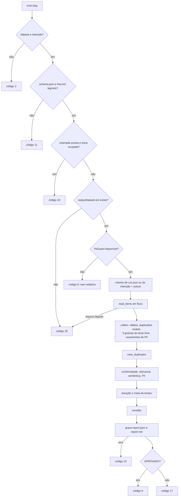
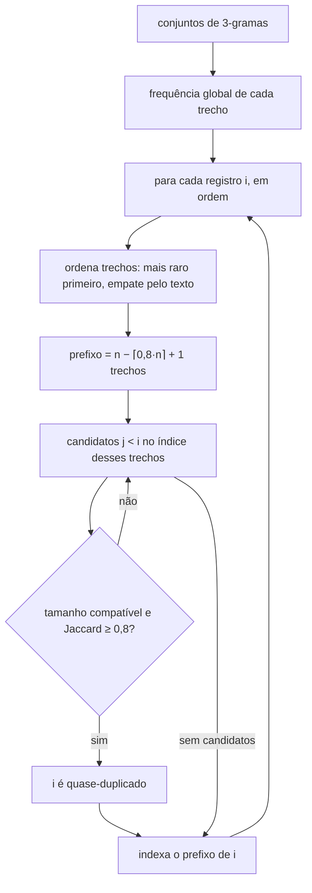

# Fluxograma: módulo `quality`

> 🟢 Extraído de `src/sintetica/quality/service.py`, `metrics.py` e `semantic.py`.

## `sintetica eval`

```mermaid
flowchart TD
    A[eval slug] --> B{dataset e intenção?}
    B -- não --> E2[código 2]
    B -- sim --> C{schema.json e Record legíveis?}
    C -- não --> E11[código 11]
    C -- sim --> D{chamada avulsa e trava ocupada?}
    D -- sim --> E16[código 16]
    D -- não --> F{output/dataset.ext existe?}
    F -- não --> E18[código 18]
    F -- sim --> G{PiiGuard disponível?}
    G -- não --> E9[código 9, sem relatório]
    G -- sim --> H[volume de run.json ou da intenção + avisos]
    H --> I[read_items em fluxo]
    I -- arquivo ilegível --> E18
    I --> J[collect: válidos, duplicados exatos,<br/>3-gramas do texto livre, vazamentos de PII]
    J --> K[near_duplicates]
    K --> L[conformidade, estrutural, semântica, PII]
    L --> M[duração e meta de tempo]
    M --> N[veredito]
    N --> O[grava report.json e report.md]
    O -- erro --> E10[código 10]
    O --> P{APROVADO?}
    P -- sim --> R0[código 0]
    P -- não --> R17[código 17]
```

## Quase-duplicados acima de 1.000 registros

```mermaid
flowchart TD
    A[conjuntos de 3-gramas] --> B[frequência global de cada trecho]
    B --> C[para cada registro i, em ordem]
    C --> D[ordena trechos: mais raro primeiro, empate pelo texto]
    D --> E[prefixo = n − ⌈0,8·n⌉ + 1 trechos]
    E --> F[candidatos j &lt; i no índice desses trechos]
    F --> G{tamanho compatível e Jaccard ≥ 0,8?}
    G -- sim --> H[i é quase-duplicado]
    G -- não --> F
    H --> I[indexa o prefixo de i]
    F -- sem candidatos --> I
    I --> C
```
