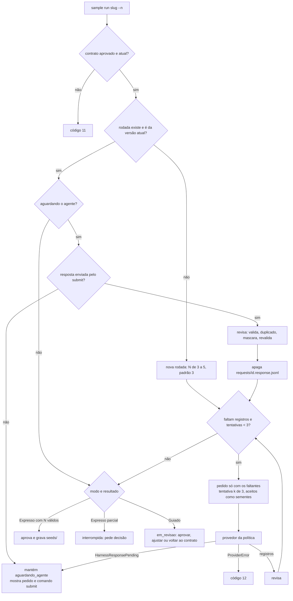
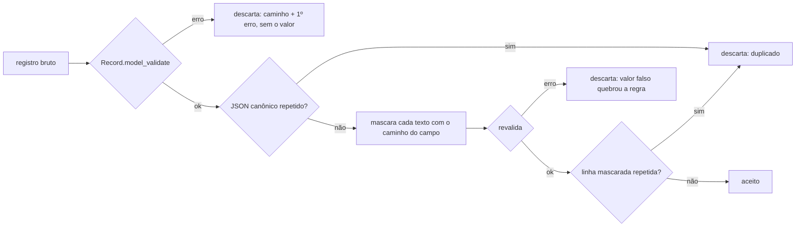

# Fluxograma: módulo `sample`

> 🟢 Extraído de `src/sintetica/sample/service.py` e `review.py`.

## `sintetica sample run`

```mermaid
flowchart TD
    A[sample run slug --n] --> B{contrato aprovado e atual?}
    B -- não --> E11[código 11]
    B -- sim --> C{rodada existe e é da versão atual?}
    C -- não --> D[nova rodada: N de 3 a 5, padrão 3]
    C -- sim --> P{aguardando o agente?}
    D --> L
    P -- não --> FIM
    P -- sim --> R{resposta enviada pelo submit?}
    R -- não --> W[mantém aguardando_agente<br/>mostra pedido e comando submit]
    R -- sim --> RV[revisa: valida, duplicado, mascara, revalida]
    RV --> DEL[apaga requests/id.response.jsonl]
    DEL --> L{faltam registros e tentativas < 3?}
    L -- sim --> Q[pedido só com os faltantes<br/>tentativa k de 3, aceitos como sementes]
    Q --> PR[provedor da política]
    PR -- HarnessResponsePending --> W
    PR -- ProviderError --> E12[código 12]
    PR -- registros --> RV2[revisa]
    RV2 --> L
    L -- não --> FIM{modo e resultado}
    FIM -- Expresso com N válidos --> AP[aprova e grava seeds/]
    FIM -- Expresso parcial --> INT[interrompida: pede decisão]
    FIM -- Guiado --> REV[em_revisao: aprovar, ajustar ou voltar ao contrato]
```

## Revisão de 1 registro

```mermaid
flowchart LR
    A[registro bruto] --> B{Record.model_validate}
    B -- erro --> X[descarta: caminho + 1º erro, sem o valor]
    B -- ok --> C{JSON canônico repetido?}
    C -- sim --> D[descarta: duplicado]
    C -- não --> E[mascara cada texto com o caminho do campo]
    E --> F{revalida}
    F -- erro --> G[descarta: valor falso quebrou a regra]
    F -- ok --> H{linha mascarada repetida?}
    H -- sim --> D
    H -- não --> I[aceito]
```
