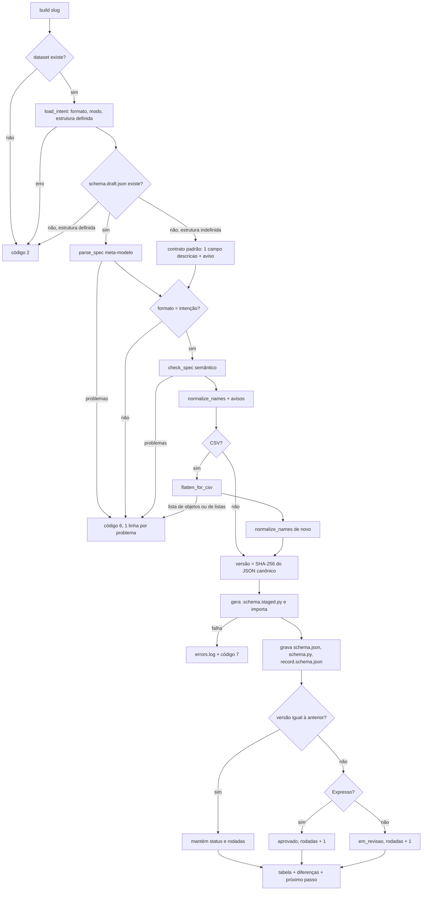
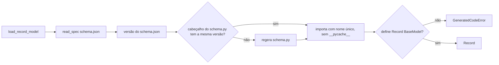

# Fluxograma: módulo `schema`

> 🟢 Extraído de `src/sintetica/schema/service.py`, `loader.py` e `state.py`.

## `sintetica schema build`

```mermaid
flowchart TD
    A[build slug] --> B{dataset existe?}
    B -- não --> E2[código 2]
    B -- sim --> C[load_intent: formato, modo, estrutura definida]
    C -- erro --> E2
    C --> D{schema.draft.json existe?}
    D -- não, estrutura indefinida --> DS[contrato padrão: 1 campo descricao + aviso]
    D -- não, estrutura definida --> E2
    D -- sim --> P[parse_spec meta-modelo]
    P -- problemas --> E6[código 6, 1 linha por problema]
    P --> F{formato = intenção?}
    DS --> F
    F -- não --> E6
    F -- sim --> K[check_spec semântico]
    K -- problemas --> E6
    K --> N[normalize_names + avisos]
    N --> G{CSV?}
    G -- sim --> FL[flatten_for_csv]
    FL -- lista de objetos ou de listas --> E6
    FL --> N2[normalize_names de novo]
    G -- não --> V
    N2 --> V[versão = SHA-256 do JSON canônico]
    V --> S[gera .schema.staged.py e importa]
    S -- falha --> E7[errors.log + código 7]
    S --> W[grava schema.json, schema.py, record.schema.json]
    W --> ST{versão igual à anterior?}
    ST -- sim --> KEEP[mantém status e rodadas]
    ST -- não --> R{Expresso?}
    R -- sim --> AP[aprovado, rodadas + 1]
    R -- não --> RV[em_revisao, rodadas + 1]
    KEEP --> OUT[tabela + diferenças + próximo passo]
    AP --> OUT
    RV --> OUT
```

## `load_record_model`

```mermaid
flowchart LR
    A[load_record_model] --> B[read_spec schema.json]
    B --> C[versão do schema.json]
    C --> D{cabeçalho do schema.py tem a mesma versão?}
    D -- não --> E[regera schema.py]
    D -- sim --> F[importa com nome único, sem __pycache__]
    E --> F
    F --> G{define Record BaseModel?}
    G -- não --> X[GeneratedCodeError]
    G -- sim --> R[Record]
```
